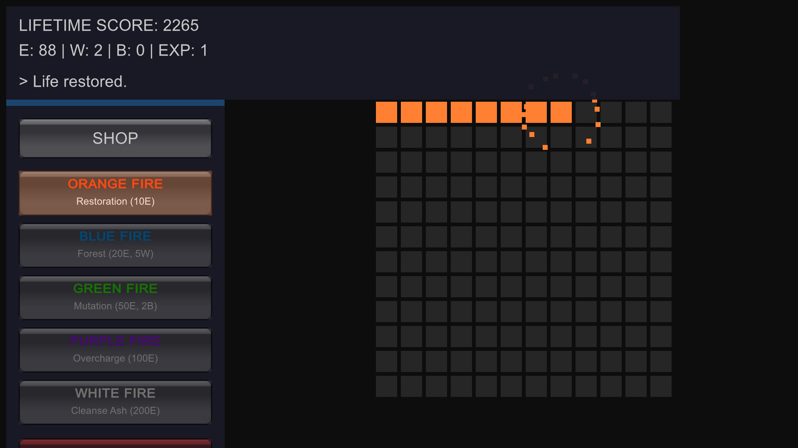
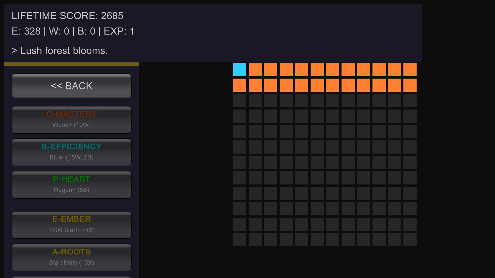

# 🦅 Phoenix Bloom
**A Strategic 2D Incremental Management Game** *Developed by Aryan Kumar*

---

## 🎮 Game Overview
**Phoenix Bloom** is a grid-based resource management game built in **Unity 6**. Players act as the guardian of a dying land, using various "Fires" to restore life, farm rare materials, and mutate the environment to reach higher energy states. The goal is to maximize energy production to trigger a **Phoenix Rebirth**, earning permanent experience to upgrade the core.

---

## 📸 Visuals & Gameplay
### 🖼️ Screenshots
| High-Energy Grid | Upgrade Shop |
| :---: | :---: |
|  |  |

  <h3>🎥 Gameplay Demo</h3>
  
Check out the core loop, particle effects, and the shop system in action:

  <video src="Screenshots/Phoenixbloom_v1.0 2026.02.20 - 11.56.48.02.mp4" width="800" controls>
    Your browser does not support the video tag.
  </video>

---

## ✨ Key Features
* **Dynamic Grid System:** A 12x12 interactive grid featuring smooth color blending and "breathing" animations for high-tier tiles.
* **Tiered Progression:** * **Orange Fire:** Restores life and harvests Wood.
    * **Blue Fire:** Creates Forests and harvests Boron.
    * **Green Fire:** Mutates land for massive energy gains.
    * **Purple/White Fire:** Overcharge life or cleanse Ash.
* **Two-Tier Economy:** * **Standard Upgrades:** Spend Wood/Boron to increase efficiency (resets on Rebirth).
    * **Phoenix Ashes:** Spend EXP for permanent starting bonuses (persists through saves).
* **Persistent Save System:** Tracks Lifetime Energy and EXP using `PlayerPrefs`.
* **Procedural Audio:** 8-bit sound effects generated mathematically via code.

---

## 🛠️ Technical Implementation
### 💻 Development Environment
* **Engine:** Unity 6 LTS (6000.3.8f1)
* **Language:** C#
* **Scripting:** Visual Studio Code

### 🧪 Key Code Systems
* **Custom Layout:** Utilizes a scaled `OnGUI` matrix for high-resolution (1440p) display support.
* **Feedback Loops:** Coroutine-based "bounce" animations and procedural particle bursts for tactile game feel.
* **Optimization:** Managed 2D array states to handle 144 simultaneous tile updates per second without performance drops.

---

## 🚀 How to Run
1. Download the latest `.zip` from the [Releases](../../releases) section.
2. Extract the folder to your computer.
3. Run `PhoenixBloom.exe`.
